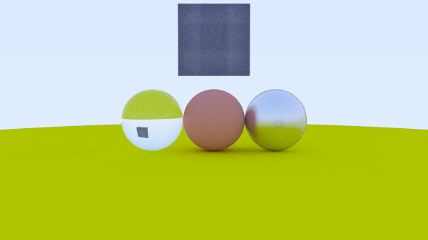

# Bitray 
## A ray tracer built in Rust

I started this project to explore computer graphics in more detail, particularly rendering and ray tracing. The code has started out as a Rust port of the code from [Ray Tracing In One Weekend](https://raytracing.github.io/books/RayTracingInOneWeekend.html).
